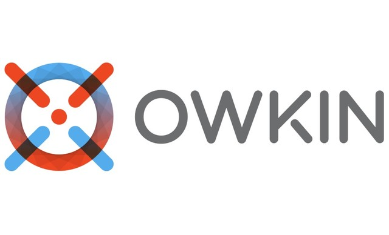

# Owkin_Challenge
> Challenge for Owkin : Predicting survival time of patients diagnosed with lung cancer.

_You can find the original description of the challenge [here](https://challengedata.ens.fr/challenges/33). Below is a summary of it._
## Challenge
[Owkin](https://owkin.com/) is a French-American startup that deploys AI and Federated Learning for medical research. Their mission is to improve patient treatment, drug discovery and augment medical research by developing machine-learning models on real-world clinical data.

The goal of the challenge they offer is to develop new methods to predict **survival time of patients** diagnosed with lung cancer, based on 3-dimensional radiology images (CT scans). 

## Context

Lung Cancer is one of the most represented cancer type (around 230.000 cases per year in the US) among which 80% are identified as Non Small Cell Lung Cancer (NSCLC). This subtype of lung cancer is characterized by peculiarly large tumors, hence called masses, which can occupy significant portions of the total lung volumes, involving serious threats to the patient’s breathing abilities.

When assessing the disease, radiologists will, among other aspects, look at the evolution through time of morphological features such as the gross tumour volume. However, being able to predict the survival of a patient from a single time point would be highly valuable as it would help in identifying prognostic features from radiology images, in addition to bringing valuable information at a low price in clinical trials.

## Goal

The challenge proposed by Owkin is a supervised survival prediction problem: predict the survival time of a patient (remaining days to live) from one three-dimensional CT scan (grayscale image) and a set of pre-extracted quantitative imaging features, as well as clinical data. 

## Data

The CT scans and the associated segmentation masks are subsets of two public datasets : [NSCLC Radiomics](https://wiki.cancerimagingarchive.net/display/Public/NSCLC-Radiomics) (subset of 285 patients) and [NSCLC RadioGenomics](https://wiki.cancerimagingarchive.net/display/Public/NSCLC+Radiogenomics) (subset of 141 patients).  
For each patient we have **3 inputs** : images (one CT scan and one mask), radiomics features and clinical data.  
The **outputs** we expect must be positive floats which represent the predicted survival time in days.

## Model

The model is a **Cox proportional hazard** ([Cox-PH](http://www.sthda.com/english/wiki/cox-proportional-hazards-model)) model.

The model regresses the proportional risk (individual risk factor) of each patient in the dataset, based on the TNM staging of this patient at t=0. The proportional risk at time *t* is formulated as follows:  

  

where ) is the baseline proportional risk factor, __*x*__ is a vector of covariates, and __*β*__ is the vector of fitted coefficients whose entries measure the impact of each covariate on the survival function.

The baseline model proposed reaches a **Concordance Index (CI)** of **0.691** on the public test set.

## Metric

The __*concordance index (C-index)*__ is a generalization of the *Area Under the Curve (or AUC)* which can take into account censored data. This metric is commonly used to evaluate and compare predictive models with censored data. The *C-index* evaluates whether predicted survival times are ranked in the same order as their true survival time.

## Approach & Challenges

In my approach, I focused mainly on the radiomics features extracted from the images and the clinical data to build my model. I was able to build a model with a *C-index* of **0.723** on the first test set, but that model failed to generalize as it scored only **0.51** on the second test set.  
That bias can be explained by the fact that the test sets are very small (63 patients) and as such variability between the two test sets is expected. However, the small size of the datasets is a real life problem that we have to deal with.  
Moreover, the challenge mentions that several studies point out that hand-defined features such as the ones used in our study can be highly biased and suboptimal for various tasks which could also be the origin of our bias.

*You can check my notebook [here](https://github.com/IlyessAgg/Owkin_Challenge/blob/master/Challenge.ipynb).*  

## Improvements

Here are some ideas as to what I could've done to improve the estimate of the patient's survival time :

* Improving our feature selection method such as to find a better combination of features.
* Including imaging modality to overcome bias from hand-defined features as we could train a network that would extract radiomics features directly from the images. We could also extract other features from our images, using a CNN for example, and build a network to select the most appropriate features for the task.
* Taking into account the censoring of the data. 

